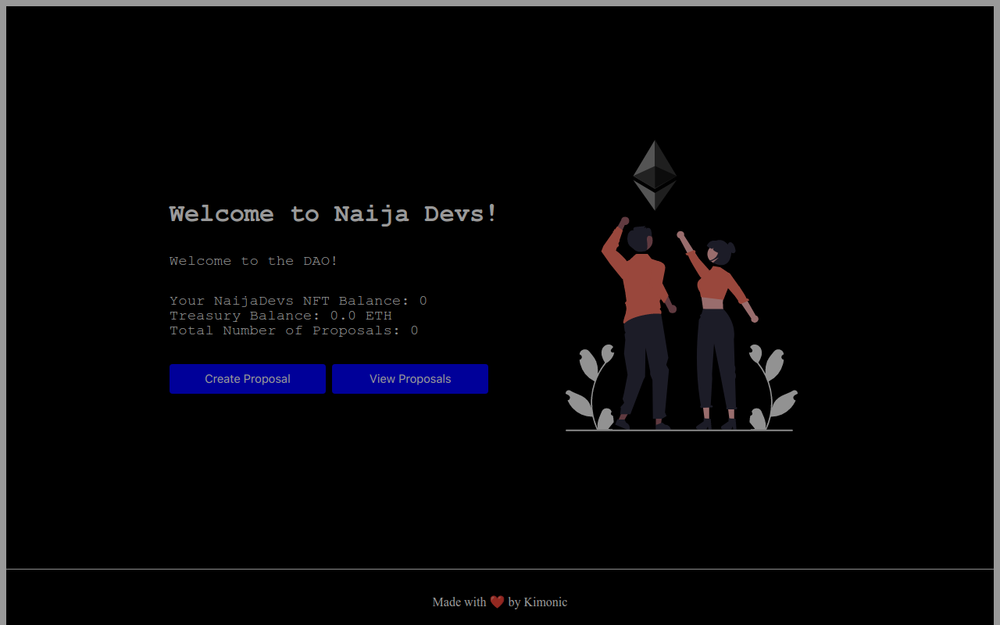

# 💎Build a DAO for your NFT holders

### [LIVE SITE ](https://naija-devs-dao.vercel.app/) ⏩ [https://naija-devs-dao.vercel.app/]

## Project Description:
This project is an implementation of a DAO for holders of NFTs. 
The DAO was established with ETH that was gained through an ICO. 
The DAO Treasury now holds a lot of ETH, but currently does nothing with it.

This project will allow NFT holders to create and vote on proposals to use the ETH from the DAO Treasury to purchase other NFTs from an NFT marketplace 
and speculate on their prices. In the long term, when NFTs are sold back, the profits will be shared among all members of the DAO.

## Requirements:
- Anyone with a NaijaDevs NFT can create a proposal to purchase a different NFT from an NFT marketplace.
- Everyone with a CryptoDevs NFT can vote for or against the active proposals.
- Each NFT counts as one vote for each proposal.
- Voter cannot vote multiple times on the same proposal with the same NFT.
- If majority of the voters vote for the proposal by the deadline, the NFT purchase is automatically executed.
- There should be a website for your NFT Collection.

## Technologies Used:
This project utilizes Ethereum, Solidity, and JavaScript. 
Ethereum is a blockchain-based platform for smart contracts and decentralized applications. 
Solidity is a programming language used to write smart contracts for Ethereum. 
Finally, JavaScript is used to interact with the Ethereum blockchain and Uniswap contract.
The frontend was developed using Next framework and the backend is in solidity.

## Project Demo 🎥


## Directory Structure 📂
- `hardhat/contracts` ⏩ Smart Contract Code [Deployed @ Goerli Test Network]
- `frontend` ⏩ Project's React frontend.

## Run this project locally 🏃🏾‍♂️💨

```shell
git clone https://github.com/Kimonic99/naija-devs-dao.git
```

### Frontend 🎨🖌

- `cd frontend`
- `npm install` Install Dependencies
- `npm run dev` Start the frontend in localhost 
- Open `http://localhost:3000` <br />
We can use the localhost frontend to interact with the smart contract on Goerli Network

### Backend 🔗

- `cd backend`
- `npm install` Install Dependencies
- `npx hardhat --version` Check if Hardhat is properly installed 
- `npx hardhat compile` Compile the Smart Contract
- `npx hardhat test` Test the Smart Contract Locally
- `npx hardhat run scripts/deploy.js` Deploy the Smart Contract Locally


### 💎 Contract Address 💎
[🚀 0xc3F2602aa604738BB08C3585426059E9466a73e3 🛸](https://goerli.etherscan.io/address/0xc3F2602aa604738BB08C3585426059E9466a73e3)
